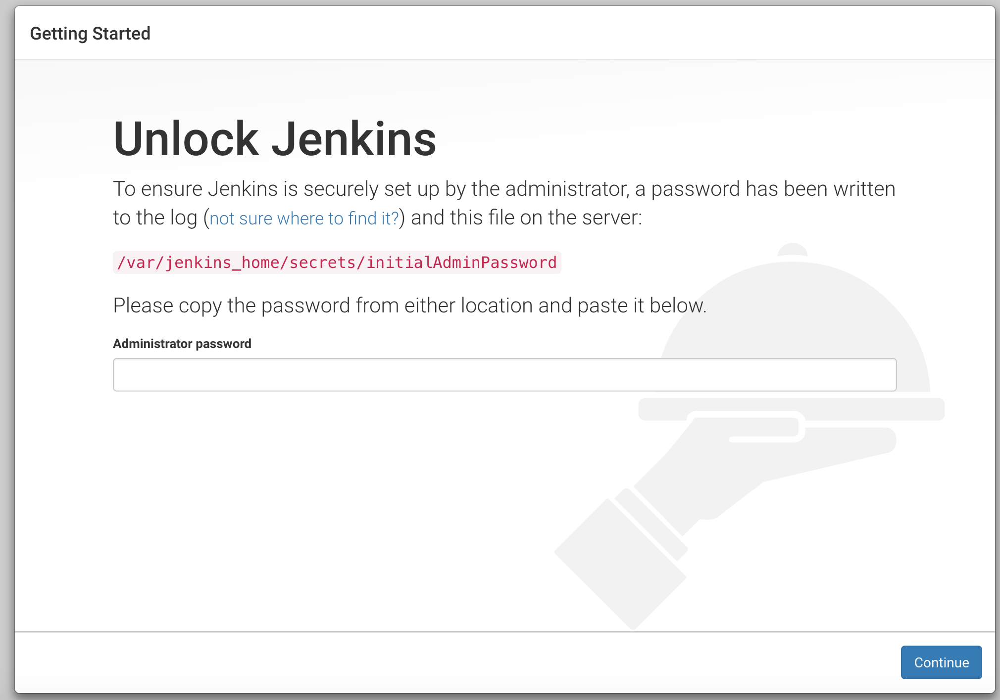
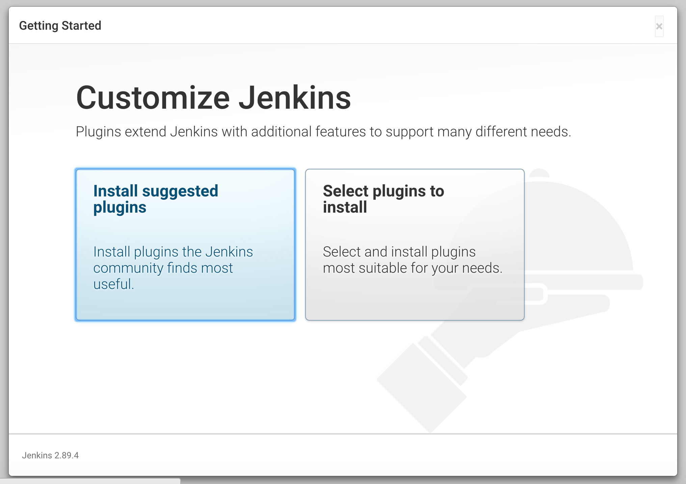
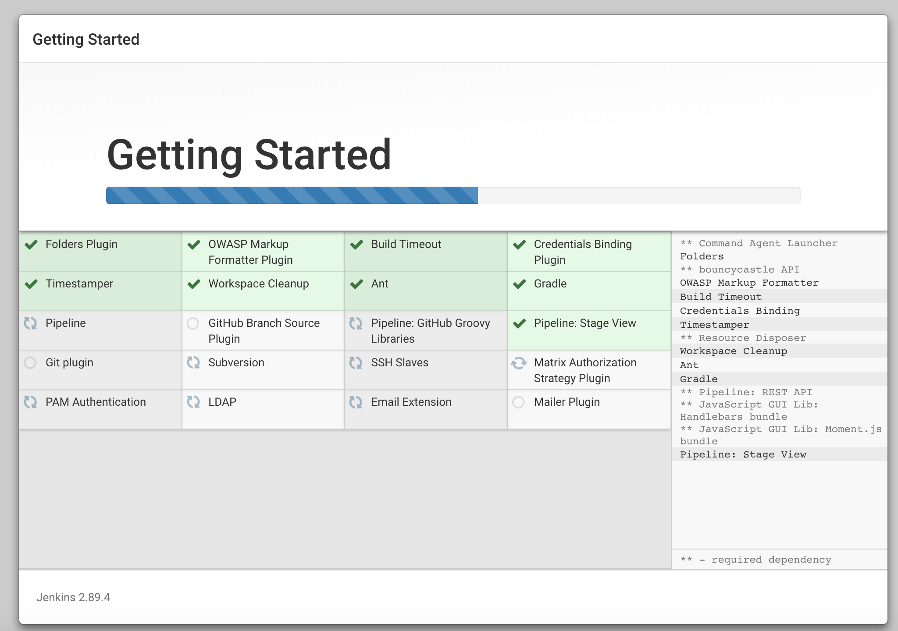
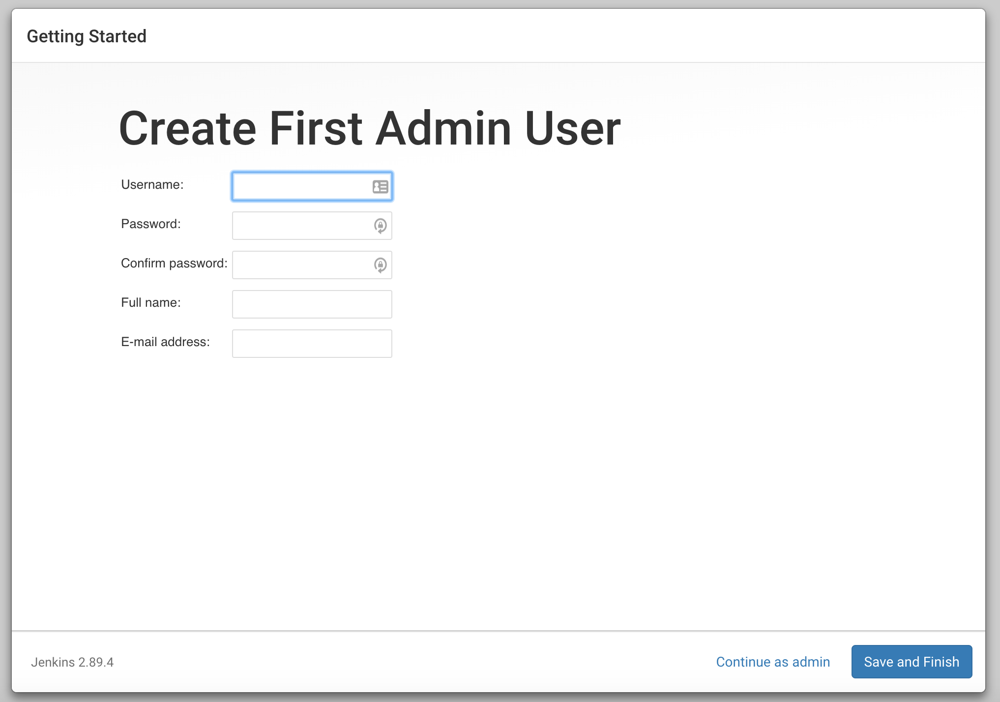
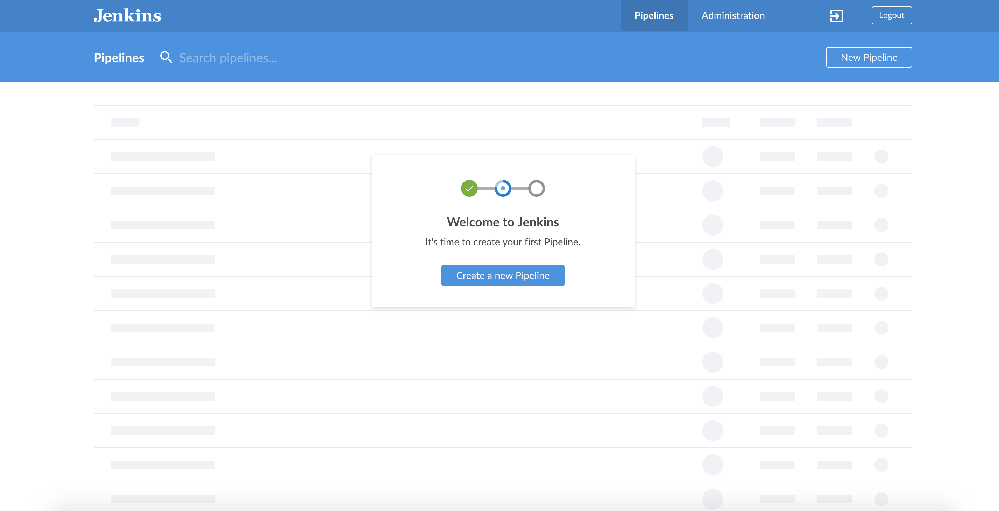
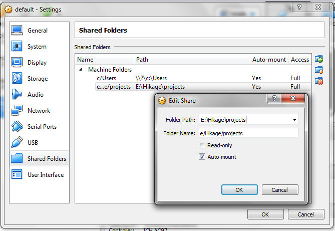

Docker Composer Setup
=====================

> How to easily get Jenkins with the Blue Ocean UI up and running on your computer using `docker` and `docker-compose`

## How to use:

0. - Install [Docker and Docker Compose](https://www.docker.com/community-edition) for your OS. 
    
   + For Windows OS without Hyper-V Capability
     + Install Docker toolbox (https://docs.docker.com/toolbox/toolbox_install_windows/)
     + Once installed you might need to remove the line `"credsStore": "wincred"` from `~/.docker/config.json`
     + Execute all command using `Docker Quickstart Terminal`

1. In your directory, copy `.env.sample` to `.env` and customize as needed.  In particular, change `JENKINS_HTTP_PORT` and `JENKINS_HTTPS_PORT` to a high port (e.g. 18443) on Minikube.

2. Run docker-compose to bring up Jenkins

```sh
$ docker-compose up -d
```

3. Get your initial admin password

```sh
$ docker-compose exec jenkins cat /var/jenkins_home/secrets/initialAdminPassword
```

4. Open Jenkins in your browser by going to either http://0.0.0.0:8080/ or https://0.0.0.0:8443/ (or whatever your Docker Machine IP is).

5. Enter your initial admin password when the setup wizard asks you to.



6. Choose `Install suggested plugins`





7. Enter your admin user details and click `Save and Finish`



8. Click `Open Blue Ocean` from the left hand menu



> Congratulations! You may now use Jenkins with the Blue Ocean UI and the Jenkins Pipelines of 2.0

## Troubleshooting

#### Mounted volumes are empty

This guide is for:
- Windows users that did not meet the system requirements of __Docker for Windows__
(You may check out the system requirements [here](https://docs.docker.com/docker-for-windows/install/#what-to-know-before-you-install))
- Uses __Docker Toolbox__
- Uses __Virtualbox__ for virtualization

_Note: We will assume that your current working directory is at `D:\Projects\Jenkins`_
_Note: All commands are executed inside the __Docker Quickstart Terminal___

1. In your virtual machine, create a shared folder that has access to your working directory
You may share `D:\Projects` instead of `D:\Projects\Jenkins`.
Everything under `D:\Projects` will be accessible in the vm.

    - Open Virtualbox
    - Open the vm's settings
        - Your vm's name is probably __default__
        - You can see which machine is currently active by running `docker-machine ls`
        The active machine should have an asterisk (`*`) on the `ACTIVE` column.
    - Under _Shared Folders_ add a new entry
        - If folder path is `D:\Projects`, folder name should be `d/Projects`
        - Tick `Auto-mount`
        - Tick `Make Permanent`



sometimes, `Make Permanent` won't be an option. Don't bother looking for that if so, it'll still be fine. Auto-mount is what we want.

2. If your vm is running, Restart your vm by executing `docker-machine restart`
If your vm is stopped, you are either not executing these inside the _quickstart terminal_
or you need to execute `docker-machine start <vm-name-here>`

3. Verify the shared folder by logging in to the vm
    - run `docker-machine ssh`
    - run `ls /d/Projects`

Now your containers should have access to your current folder.

### NOTES
- When setting up the `Folder Name` in the VM settings, assure that it's a valid linux path and must be relative to `/` (root) directory (eg `e/projects`).
- The directory that contains `jenkins` **must not contain** any whitespaces or any characters that must be escaped. (e.g `F19 Source Code`, `Source\ Code`) The reason is that it'll serve as a `Folder Name` in your VM settings, and you cannot click OK when you do supply such names.
